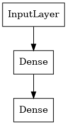
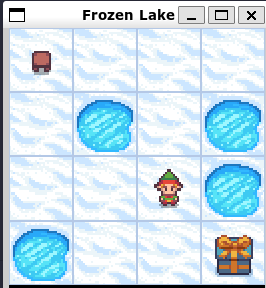
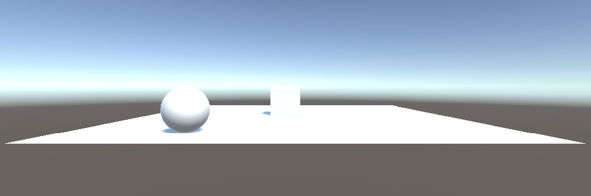
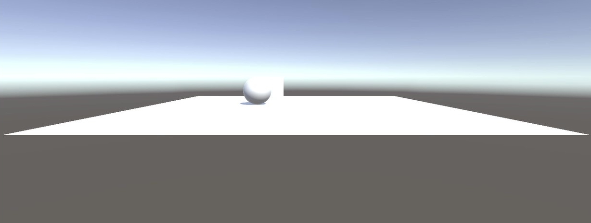
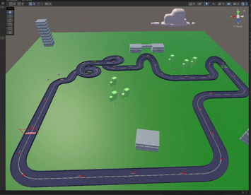
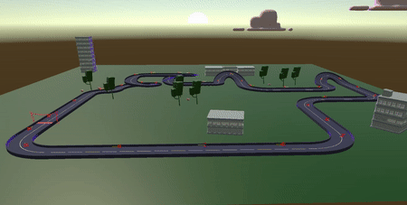
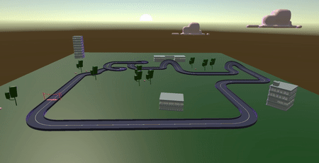

# &emsp;&emsp;&emsp; Artificial Intelligence Group Final Project

## Object Detection for Self Driving UGV Using LiDAR and RGB Data

___

## Contributors

* Daniel Brun - cur882
* Daniel Jamison - mkb622
* Ariel Guerrero - aes604
* Johann Tschetter - pzt638

[Discord Server](https://discord.gg/AQe3S42y)
___

## Objective

Transform raw data into usable point based representations. Work on data after gathering and processing it for self driving mechanisms in real time. Some parameters we must consider for the real time processing is average position, distance, and concentration of points in a certain area. When done properly, our algorithm will be able to determine the rover’s optimal path

___

## Description

The system has an Ubuntu 18.04 OS, where ROS was installed and deployed. To explain a big picture,” ROS consists of code and tools that help your project’s code run and do the required job—including the infrastructure for running it, like messages passing between processes. ROS is designed to be a loosely coupled system where a process is called a node and every node should be responsible for one task. Nodes communicate with each other using messages passing via logical channels called topics. Each node can send or get data from the other node using the publish/subscribe model”. Tawil (2017) Using ROS, the algorithm will be deployed to change the path of the rover depending on the parameters defined when reading the real-time data coming from the LiDAR as point-cloud based points to avoid obstacles.

## Hypothesis

How does reinforcement learning work affect the rovers to learn to traverse the environment?
___

## Approach: Exploration into reinforcement learning using openai gym

* Reinforcement learning is a method of machine learning that seeks to improve the performance of a learning algorithm by using feedback from the learning algorithm.

* Implemented a Deep Q-learning algorithm to train the agent to learn to play a game to dive deeper into topics in reinforcement and deep learning.

## Single Agent

* learning about ***discrete and continuous environments*** that agents can act on
randomly selecting appropriate actions to take in a given environment.

* code example: ***single_agent.ipynb***

## Q-Learning Agent

* learning about the ***concept of Q-Learning***, which is ***a form of reinforcement learning***
that uses a Q-table to store the Q-values of the actions that the agent can take
in a given environment.

* ***Q-Learning Algorithm***
* ***Q(st, at) = Rt+1 + gamma * max(Q(st+1))***

* s = state
* a = action
* Rt+1 = reward
* gamma = discount factor
* max(Q(st+1) = max Q value ***for all possible actions*** in state st+1

* reference: [Q-Learning algorithm](https://en.wikipedia.org/wiki/Q-learning)

* code example: ***q_agent.ipynb***

## Q-Learning Agent with Neural Network

* Using ***Q-Learning algorithm*** and a ***Sequential Model with two dense layers*** to
dive deeper in learning about the concept of deep learning.

&emsp;&emsp;

* code example: ***q_agent_nn.ipynb***

### **Frozen Lake** Environment

 

***[View the repository here](https://github.com/aguerrero232/deep-q-learning-agent-nn)***

___

## Approach: Applying Reinforcement Learning to a simple agent using ml-agents and unity

* ***Unity*** is a game engine that allows you to develop and test your own games, simulations, and AI agents.

* ***Unity ML-Agents*** is a library that allows you to use Unity as a platform to train and test your own agents.

* Defined a Rolling Ball Agent that acts on the environment and learns with objective of hitting the target while avoiding the obstacles (edge of the floor).

* Learns to control its own movement velocity and to avoid falling off the edge of the floor while also hitting the target.

* Final Results: ***RollerBall. Step: 500000. Time Elapsed: 3786.616 s. Mean Reward: 0.990. Std of Reward: 0.099. Final Results***

***[View Demo Here](https://play.unity.com/mg/other/webgl-builds-187355)***

***Initial Starting point for the Rolling Agent***

***Agent Moving Towards the Target (Goal) While Avoiding the Obstacles (Edge)***

___

## Approach: Applying Reinforcement Learning to an agent that stays on track and goes the appropriate direction

* First we will define the environment and the agent.
  * The environment is a plane with a repeating track that has walls and complex turns
* The agent is then trained on the environment to stay on track and go the appropriate direction by rewarding it based on its direction, speed, and ability to hit checkpoints.
  * checkpoints are points on the track that the agent must hit in order to progress to the next checkpoint.
  * The agent will receive a reward of +1 for hitting a checkpoint and -1 for hitting an obstacle.
  * The agent also utilizes sensors with different ray distances and hit validation distances to simulate using lidar and determine its direction, speed, and how far away it is from walls(obstacles).

***Training the Agent***

[Training: Click here to view in higher res](https://storage.googleapis.com/ai-videos/training.mp4)

***Testing Trained Agent On Environment***

[Test 1: Click here to view in higher res](https://storage.googleapis.com/ai-videos/testing.mp4)

***Checkpoints are left visible here to show where they are on the track.***

[Test 2: Click here to view in higher res](https://storage.googleapis.com/ai-videos/testing2.mp4)

## Reinforcement Learning Approach

Reinforcement Learning is a method of machine learning that seeks to improve the performance of an agent by taking action and rewards the agent based on the action taken. The goal of reinforcement learning is to train a machine to learn from experience without being explicitly told what the correct answer is. To traverse terrain that is not known to the agent, the agent must learn to use the information it has gained from experience to make decisions that are more likely to lead to success.

We have implemented a Deep Q-learning algorithm to train one of our agents to learn to traverse a given environment diving deeper into topics in reinforcement and deep learning. We also utilized the Unity ML Agents to create a separate agent that can learn to control its own movement velocity and to avoid falling off the edge of the floor while also hitting a specified target that is randomly placed in the environment. By using the Deep Q-learning algorithm and the Unity ML Agents, we have learned to use reinforcement learning to train our own agents to act on environments while avoiding failure, maximizing reward, to dive deeper into topics in reinforcement, machine, and deep learning.

## Reinforcement Learning Results

After training the Unity agent over 500,000 steps over 3786.616 seconds. The agent attained a mean reward of 0.990 with a standard deviation of 0.099. The agent collected x and z position, and velocity data from the environment and plotted the data to show the agent’s path. Initially, the agent was slow and moved randomly. After training the agent, it began to learn to control its movement and velocity where it would make mistakes by either going to fast and falling off the edge of the floor then after several thousand steps, it would learn to avoid falling off the edge of the floor and hit the target. At the end of training the agent learned to precisely control its own movement and velocity to avoid falling off the edge of the floor while also hitting the target confirming that the agent operates as it is intended. Moving on to creating an agent that can learn to navigate a complex track with checkpoints and obstacles turned out to be more difficult than the agent that was created to learned to navigate to a given target. The original agent was given a new reward system that would reward the agent for hitting a checkpoint and take points away for avoiding obstacles(the walls of the track). The agent utilized sensors with different ray distances and hit validation distances to simulate using lidar and determine its direction, speed, and how far away it is from walls(obstacles). The agent was able to learn to navigate the track and hit the target while avoiding obstacles after training for 500,000 steps over 4501 seconds. The mean reward of the agent was 2626 points with a standard deviation of 1872 points.
